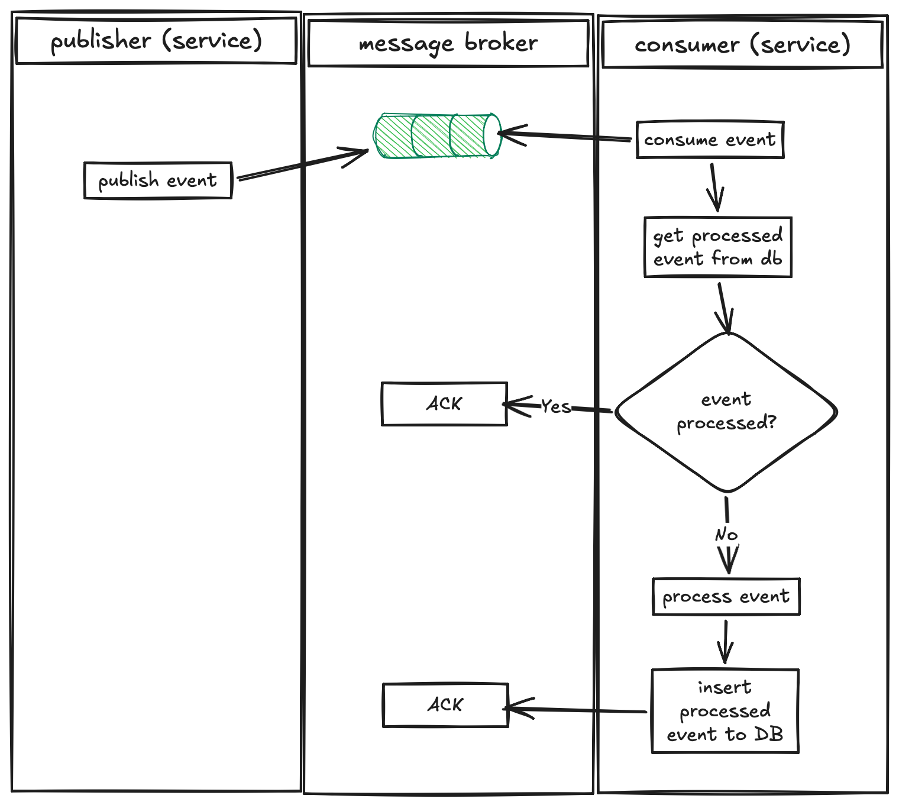

# Idempotent Consumer
Bayangkan skenario ini:
```
RabbitMQ
-> Retry
-> At-least-once delivery
```

Artinya secara teori Message dapat diproses lebih dari satu kali, dan ini normal.

Contoh kasus:

```
order.created
-> email service
-> email berhasil dikirim
```

Lalu, tepat setelah email berhasil dikirim tapi sebelum ACK terjadi, container crash. Akibatnya message broker tidak pernah menerima ACK, maka message dikirim lagi (lewat mekanisme retry) dan user menerima dua email yang sama.

---

Untuk meminimalisir kejadian ini, maka teknik idempotent consumer bisa diterapkan. Yaitu dengan melakukan pemeriksaan lapis kedua di sisi consumer. 

```
order.created
-> email service
-> check apakah message sudah diproses
    -> jika ya, jangan diproses, ACK
    -> jika tidak, proses, simpan event di DB, ACK
```
Dengan teknik ini, sekalipun ACK tidak pernah diterima oleh broker, kali berikutnya message di-retry maka consumer akan langsung return dan ACK karena message sudah pernah diproses dan disimpan di DB.





**NOTE**: tapi metode ini TIDAK MENJAMIN proses di lakukan TEPAT SATU KALI (exactly once delivery), sifatnya hanya meminimalisir. Message akan tetap dijalankan lbh dari satu kali jika:
```
-> email service
-> check apakah message sudah diproses
-> belum, proses
-> proses sukses
-> CONTAINER CRASH!
```

Jika container crash sebelum proses penandaan/penulisan event yang sudah diproses di DB, maka event tidak pernah tercatat di db, dan saat retry message akan langsung diproses (lagi).